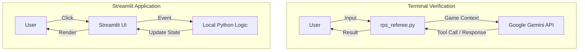

# 🎮 Rock-Paper-Scissors-Plus (RPS+)

A modern twist on the classic game, featuring an AI Referee and an explosive "Bomb" mechanic. Play against a bot in a best-of-3 showdown.

## ✨ Features
- **Classic Rules**: Rock beats Scissors, Scissors beats Paper, Paper beats Rock.
- **The Bomb**: A special move that beats everything but can only be used **once** per game.
- **Two Ways to Play**:
    - **CLI Mode**: An Agentic AI Referee powered by **Google Gemini** orchestrates the game.
    - **Web Mode**: A fast, interactive UI built with **Streamlit**.

## 🏗️ Architecture

The project supports two distinct architectural patterns for the game logic.



## 🚀 Getting Started

### Prerequisites
- Python 3.8+
- A [Google Gemini API Key](https://aistudio.google.com/app/apikey) (for CLI mode)

### Installation

1. **Clone the repository**
   ```bash
   git clone https://github.com/Luqmaan29/Game_Simulator_Upliance.git
   cd Game_Simulator_Upliance
   ```

2. **Set up Environment**
   Create a `.env` file in the root directory:
   ```bash
   GOOGLE_API_KEY=your_api_key_here
   ```

3. **Install Dependencies**
   ```bash
   pip install google-genai python-dotenv streamlit
   ```

## 🕹️ How to Play

### Option 1: AI Referee (CLI)
Experience the game with an AI personality managing the rules.
```bash
python3 rps_referee.py
```

### Option 2: Web Interface (Streamlit)
Play with a graphical interface.
```bash
streamlit run app.py
```

## 📜 Rules
1. **Best of 3 Rounds**.
2. **Bomb Mechanic**: 
   - Beats Rock, Paper, and Scissors.
   - Using it twice wastes your turn (automatic loss for that round).
   - If both players use Bomb, it's a Draw.

---
*Built for the Upliance Game Simulator Project.*
