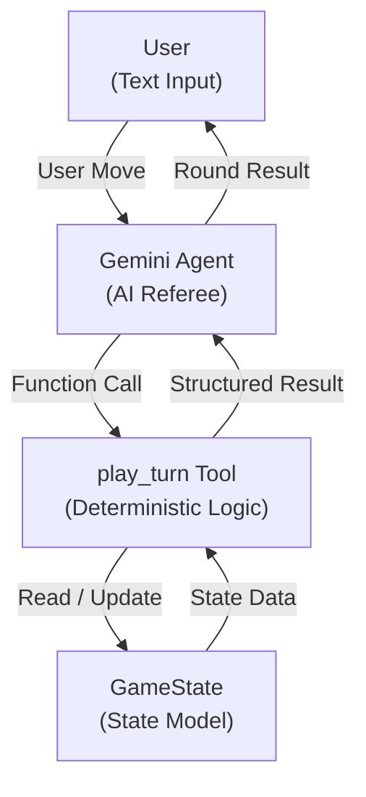
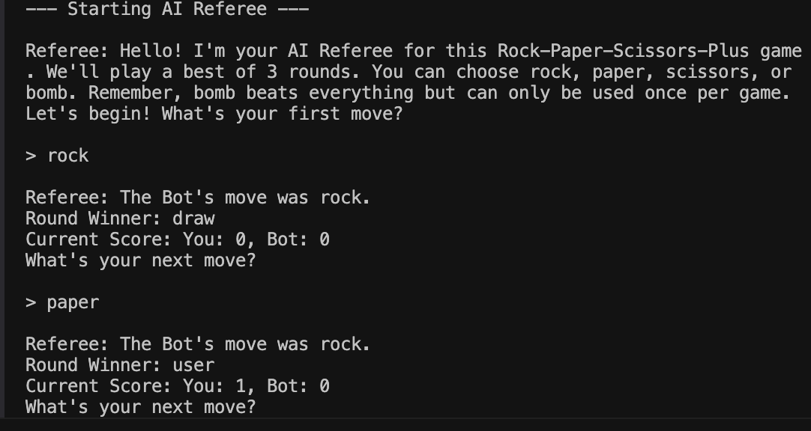
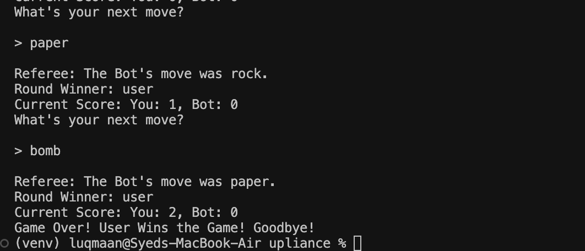

# Rock Paper Scissors Game - AI Referee  
*A Rock–Paper–Scissors Game using Google ADK*

---

## Overview

This project implements a **AI Game Referee chatbot** for the game **Rock–Paper–Scissors–Plus**.  
A Gemini-based agent acts as the **referee**, while all game rules and state updates are handled by **deterministic Python logic** using Google ADK tools.

The project focuses on **correctness, clean state modeling, and clear separation between AI reasoning and game logic**.

---

## Game Rules

- The game is **best of 3 rounds**
- Valid moves:
  - `rock`
  - `paper`
  - `scissors`
  - `bomb` (can be used **only once per player per game**)
- **Bomb beats all other moves**
- **Bomb vs Bomb results in a draw**
- **Invalid input wastes the round**
- The game **ends automatically after 3 rounds**

---

## Architecture Diagram



---

## State Model

The game state is encapsulated inside a dedicated `GameState` class.
This ensures that the AI agent cannot directly modify the state and that all updates remain consistent and deterministic.

### Core State Variables

* `round_count` *(int)*
  Tracks the current round (maximum of 3).
* `user_score`, `bot_score` *(int)*
  Maintains scores across rounds.
* `user_bomb_used`, `bot_bomb_used` *(bool)*
  Enforces one-time bomb usage per player.
* `game_over` *(bool)*
  Indicates when the game reaches its terminal state.

### State Transitions

All state transitions occur **only through deterministic functions** (specifically `play_round`).
This design guarantees:

* The AI agent **cannot hallucinate scores or rules**
* Game behavior remains **predictable and fair**
* State persists correctly across turns

---

## Agent and Tool Design

The system follows a **clear separation of responsibilities** using Google ADK.

### Agent (Gemini – AI Referee)

* Handles all conversational interaction
* Responsibilities:

  * Welcome the user and explain the rules (≤ 5 lines)
  * Interpret user intent (e.g., "rock", "use bomb")
  * Call the appropriate tool
  * Announce round outcomes and scores

### Tool (`play_turn`)

* Acts as the **single source of truth**
* Responsibilities:

  * Validate user input
  * Enforce bomb usage constraints
  * Resolve round outcomes
  * Update and return game state

### Data Flow

```
User Input → LLM (Intent Understanding)
          → play_turn Tool (Validation & State Update)
          → LLM (Result Explanation)
```

---

## Tradeoffs Made

* **Deterministic Rules vs Generative Logic**
  Game rules are hardcoded in Python instead of being decided by the LLM.
  This prevents hallucinations and ensures fairness, at the cost of reduced flexibility.

* **In-Memory State Management**
  State is stored in a Python object.
  This keeps the implementation simple and fast but does not persist across restarts.

* **Synchronous Tool Execution**
  The agent waits for the tool response before replying.
  This simplifies control flow and is suitable for a lightweight game.

---
## Future Improvements

* Persist game state using SQLite or Redis
* Implement smarter bot strategies using probabilistic or learning-based models
* Add match history and analytics
* Enhance conversational feedback and narration

---

## Screenshots







## How to Run

1. Install dependencies:
   pip install google-genai python-dotenv

2. Set your API key:
   export GOOGLE_API_KEY=your_api_key_here

3. Run the game:
   python3 rps_referee.py
